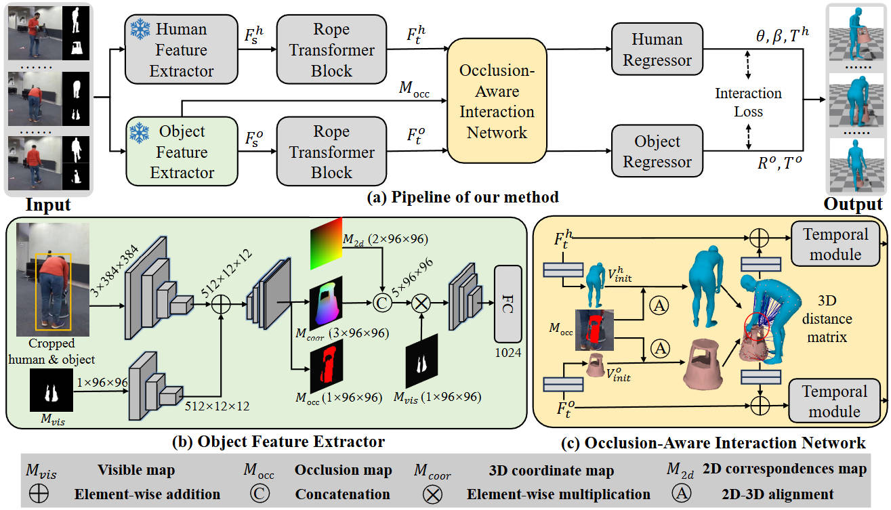

<div align="center">

# From Hybrid to Fully Deep Learning: An Efficient Framework for 3D Human-Object Interaction Tracking

**Yongchang Zhang¹, Boxuan Xu¹, Rongkang Zhang, Zhaowen Lin\*, Anlong Ming\***

¹ Beijing University of Posts and Telecommunications (BUPT)

**🏆 Winner of the CVPR 2025 RHOBIN Challenge - Tracking human-object interaction**

<a></a>
<a href="https://pytorch.org/get-started/locally/"></a>

[**[Paper (Coming Soon)]**](#) | [**[Project Page]**](https://zyc-cver.github.io/FDTracker/)

</div>

---
>The paper is currently under review, and more code will be released after the review is completed.

**FDTracker** is a fully deep learning framework that outperforms state-of-the-art hybrid methods in 3D human-object interaction tracking, offering significantly higher accuracy and much faster inference speeds through a streamlined, optimization-free pipeline.
<div align="center">
  
</div>

# Installation

```
conda create -n FDTracker python=3.8
conda activate FDTracker

conda install pytorch==1.8.1 torchvision==0.9.1 torchaudio==0.8.1 -c pytorch

pip install -r requirements.txt
```

# Data Preparation

Please download the required data from [**[Google Drive]**](https://drive.google.com/drive/folders/1QvTpTwTpnWialVc2yelnvCWuTyohs-e1?usp=sharing).

Organize your data directory as follows:

```
data/
├── base_data/
│   ├── human_models/         # SMPL/SMPL-h models
│   ├── object_models/        # Object meshes
│   ├── down_sample.npy
│   └── ref_hoi.pkl        
└── datasets/
    ├── Demo/
    ├── BEHAVE/
    │   ├── train_data/
    │   │   ├── hum_feat/     # Human features
    │   │   ├── obj_feat/     # Object features
    │   │   ├── overlap/      # Object occlusion masks
    │   │   ├── gt.pt
    │   │   ├── metadata.pt
    │   │   └── hum_bbox.pt
    │   └── val_data/
    │       ├── hum_feat/
    │       ├── obj_feat/
    │       ├── overlap/
    │       ├── gt.pt
    │       ├── metadata.pt
    │       └── hum_bbox.pt
    └── InterCap/
        ├── train_data/       # (Same structure as BEHAVE)
        └── val_data/         # (Same structure as BEHAVE)
```

# Quick Start

To quickly evaluate our model without setting up the full training pipeline, you can use our provided demo data and pretrained weights.

### 1. Download Demo Data & Weights: 
Download the demo package and checkpoint from [**[Google drive]**](https://drive.google.com/drive/folders/1QvTpTwTpnWialVc2yelnvCWuTyohs-e1?usp=sharing).

### 2. Run Inference:
```
python main/test.py --data-path <path_to_demo_data> --checkpoint <path_to_checkpoint>
```

### 3. Visualize the prediction results:
```
python render/render_global.py --results_path <path_to_demo_output> --metadata-path Demo/val_data/metadata.pt
```

# Running FDTracker

### Train:

To train the model on either the BEHAVE or InterCap datasets:
```
python main/train.py --data-path data/datasets/{dataset_name}/train_data --dataset-name {dataset_name}
```

### Test:

To evaluate the model:
```
python main/test.py --data-path data/datasets/{dataset_name}/val_data --checkpoint <path_to_checkpoint>
```
